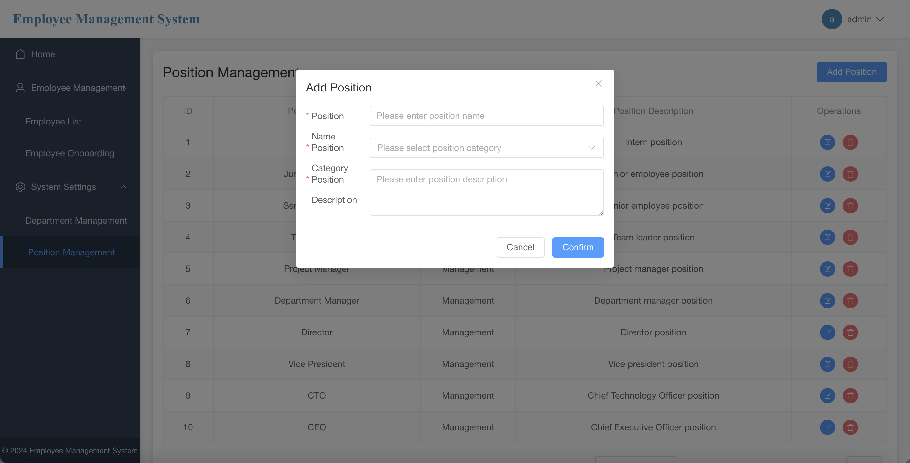

# Employee Management System

## Overview

The Employee Management System is a web application designed to manage employee records, departments, and related functionalities. 

## Features

- User authentication and authorization
- Employee management (add, update, delete, view)
- Department management (add, update, delete, view)
- Work experience tracking for employees
- Responsive design for mobile and desktop
- API integration for backend services

## Technologies Used

- **Frontend**: Vue.js, Vite, Element Plus
- **Backend**: Spring Boot, MyBatis, MySQL
- **Database**: MySQL
- **File Storage**: MinIO
- **Authentication**: JWT (JSON Web Tokens)

## Getting Started

### Prerequisites

- Java 17 or higher
- Node.js (version 14 or higher)
- MySQL database
- MinIO server (for file storage)

### Installation

1. **Clone the repository**

   ```bash
   git clone https://github.com/ChrisChln/employee-management-system.git
   cd employee-management-system
   ```

2. **Backend Setup**

   - Navigate to the `backend` directory.

   - Update the `src/main/resources/application.yml` or `application.properties` file with your database credentials.

   - Build the backend project using Maven:

     ```bash
     cd backend
     mvn clean install
     ```

3. **Frontend Setup**

   - Navigate to the `frontend` directory.

   - Install the required dependencies:

     ```bash
     cd frontend
     npm install
     ```

4. **Run the Application**

   - Start the backend server:

     ```bash
     cd backend
     mvn spring-boot:run
     ```

   - Start the frontend development server:

     ```bash
     cd frontend
     npm run dev
     ```

5. **Access the Application**

   - Open your web browser and navigate to `http://localhost:3000` to access the application.

## API Documentation

The backend API is built using Spring Boot and follows RESTful principles. You can find the API documentation at `/api/docs` once the server is running.

## Contributing

Contributions are welcome! Please follow these steps to contribute:

1. Fork the repository.
2. Create a new branch (`git checkout -b feature/YourFeature`).
3. Make your changes and commit them (`git commit -m 'Add some feature'`).
4. Push to the branch (`git push origin feature/YourFeature`).
5. Open a pull request.


  ---

## **🔹 Login Page**


## **🔹 Home Page**


---

## **🔹 Department Management**
### ➤ Add Department


### ➤ Department Management Dashboard


---

## **🔹 Employee Management**
### ➤ Add Employee


### ➤ Edit Employee


### ➤ Employee Detail


### ➤ Employee List


### ➤ Employee Onboarding


---

## **🔹 Position Management**
### ➤ Add Position


### ➤ Position Management Dashboard


---

## Acknowledgments

- [Spring Boot](https://spring.io/projects/spring-boot)
- [Vue.js](https://vuejs.org/)
- [MyBatis](https://mybatis.org/)
- [Element Plus](https://element-plus.org/)
- [MinIO]((https://min.io/docs/kes/))
